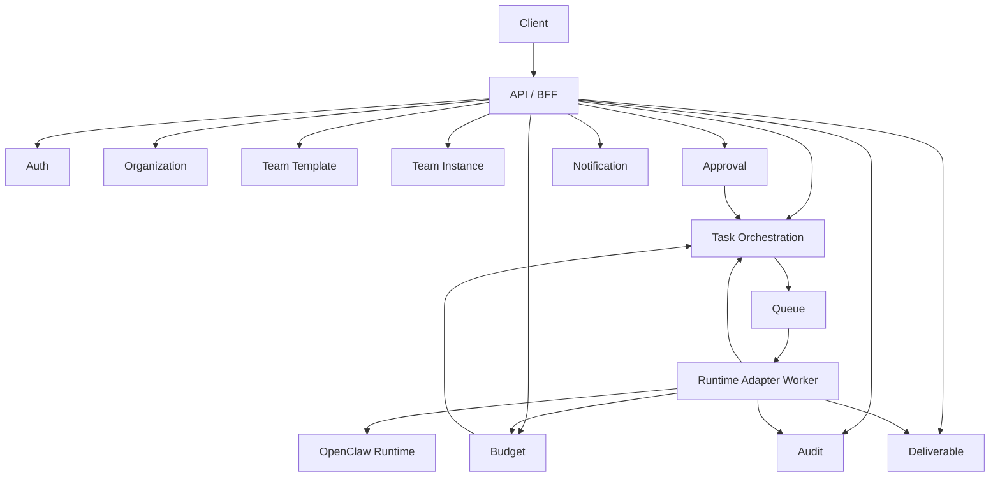

# OpenClaw Team OS 系统模块与 API 草图

- 文档版本：v0.1
- 文档状态：Draft
- 更新日期：2026-04-08
- 关联文档：
  - `OpenClaw_Team_OS_PRD.md`
  - `OpenClaw_Team_OS_Tech_Architecture.md`
- 目标：将 PRD 和技术架构进一步下沉为“首版可开工”的模块清单、接口草图与事件模型

## 1. 文档使用方式

本文档用于回答 4 个具体问题：

1. 首版后端到底要有哪些核心模块。
2. 每个模块负责什么，不负责什么。
3. 客户端应该调用哪些 API。
4. OpenClaw Runtime Adapter 在系统里扮演什么角色。

本文档默认服务于 `MVP / Design Partner 阶段`，不是未来全平台的最终接口形态。

## 2. 首版实现假设

### 2.1 实现边界

首版按以下原则落地：

- 产品层独立于 OpenClaw UI
- 客户端只调用 Team OS API
- OpenClaw 作为执行引擎，由 Runtime Adapter 隔离
- 首版只支持一个官方团队模板：`AI 增长与内容运营组`

### 2.2 推荐部署形态

首版建议采用：

- 一个 `API / BFF`
- 一个 `Worker / Runtime Adapter`
- 一个 `Postgres`
- 一个 `Redis`
- 一个 `Object Storage`
- 一套或多套 `OpenClaw Gateway / Runtime`

### 2.3 推荐接口风格

首版建议：

- 外部业务接口：`REST`
- 实时状态更新：`SSE`
- 内部异步执行：`Queue + Worker`

理由：

- REST 足够支撑客户端大部分页面
- SSE 更适合工作台持续状态更新，接入复杂度低于双向 WebSocket
- Worker 方便隔离长任务与 OpenClaw 调用

## 3. MVP 系统模块清单

首版建议采用 `模块化单体 + Worker`，逻辑上拆模块，部署上先不强拆微服务。

### 3.1 Auth & Session 模块

职责：

- 用户登录
- 会话维持
- 当前用户信息返回
- 当前组织上下文切换

不负责：

- 组织内复杂 RBAC 规则执行细节

核心对象：

- User
- Session
- OrganizationMembership

### 3.2 Organization 模块

职责：

- 组织信息管理
- 成员管理
- 成员角色维护

不负责：

- 团队模板定义
- 任务执行逻辑

核心对象：

- Organization
- OrganizationMember
- RoleAssignment

### 3.3 Team Template 模块

职责：

- 官方团队模板查询
- 团队模板版本管理
- 岗位定义与默认审批、预算规则配置

不负责：

- 已雇佣团队运行时状态

核心对象：

- TeamTemplate
- RoleTemplate
- TemplateVersion

### 3.4 Team Instance 模块

职责：

- 用户雇佣团队
- 生成团队实例
- 保存组织与模板绑定关系
- 保存团队实例的预算与审批配置

不负责：

- 具体任务执行

核心对象：

- TeamInstance
- TeamRoleBinding
- TeamPolicyBinding

### 3.5 Task Orchestration 模块

职责：

- 创建任务
- 生成任务节点
- 推进业务状态机
- 处理重试、暂停、取消

不负责：

- 直接执行 OpenClaw 调用

核心对象：

- Task
- TaskStep
- TaskRun

### 3.6 Approval 模块

职责：

- 创建审批项
- 处理批准、驳回、要求修改
- 将审批结果回写任务状态机

核心对象：

- ApprovalItem
- ApprovalDecision

### 3.7 Budget 模块

职责：

- 保存预算策略
- 聚合成本记录
- 命中阈值时触发预算保护

核心对象：

- BudgetPolicy
- CostRecord
- BudgetAlert

### 3.8 Audit 模块

职责：

- 记录关键操作
- 提供审计日志查询

核心对象：

- AuditLog
- AuditActor

### 3.9 Deliverable 模块

职责：

- 管理交付物元数据
- 管理预览、下载、导出信息

核心对象：

- Deliverable
- DeliverableVersion

### 3.10 Notification 模块

职责：

- 生成应用内通知
- 推送待审批提醒
- 预算预警
- 任务完成提醒

核心对象：

- Notification
- NotificationPreference

### 3.11 Runtime Adapter 模块

职责：

- 将业务任务翻译为 OpenClaw 运行请求
- 消费 OpenClaw 事件并映射业务状态
- 将底层执行结果写回任务、交付物、日志

核心对象：

- RuntimeBinding
- RuntimeExecution
- RuntimeEvent

## 4. 模块之间的调用关系



## 5. 首版建议的业务状态机

### 5.1 Task.status

建议值：

- `draft`
- `queued`
- `running`
- `waiting_approval`
- `approved`
- `rejected`
- `paused_budget_guard`
- `failed`
- `completed`
- `cancelled`

### 5.2 TaskStep.status

建议值：

- `pending`
- `running`
- `waiting_approval`
- `completed`
- `failed`
- `skipped`
- `blocked`

### 5.3 ApprovalItem.status

建议值：

- `pending`
- `approved`
- `rejected`
- `changes_requested`
- `expired`

## 6. API 设计原则

### 6.1 前缀与版本

建议统一前缀：

- `/api/v1`

### 6.2 返回格式

建议统一返回格式：

```json
{
  "data": {},
  "meta": {},
  "error": null
}
```

错误时：

```json
{
  "data": null,
  "meta": {},
  "error": {
    "code": "BUDGET_LIMIT_EXCEEDED",
    "message": "Task paused because budget threshold was reached."
  }
}
```

### 6.3 ID 策略

建议首版统一使用：

- `uuid` 或 `ulid`

推荐 `ulid`，因为：

- 排序更友好
- 日志和任务列表更易读

### 6.4 鉴权策略

建议使用：

- Web / Desktop：`HttpOnly Cookie Session` 或 `Bearer Token`
- Mobile：`Bearer Token`

如果团队没有现成登录系统，首版可以先用邮箱魔法链接或邀请码。

## 7. API 草图

以下为首版建议接口，不是要求一次性全部实现，但建议按这个方向建模。

### 7.1 Auth / Me

#### `GET /api/v1/me`

用途：

- 获取当前用户与当前组织上下文

返回示例：

```json
{
  "data": {
    "user": {
      "id": "01JXYZUSER",
      "name": "Wang Liang",
      "email": "demo@example.com"
    },
    "currentOrganization": {
      "id": "01JXYZORG",
      "name": "OpenClaw Studio",
      "role": "org_admin"
    }
  },
  "meta": {},
  "error": null
}
```

#### `POST /api/v1/session/switch-organization`

用途：

- 切换当前组织上下文

请求示例：

```json
{
  "organizationId": "01JXYZORG"
}
```

### 7.2 Organizations

#### `GET /api/v1/organizations`

用途：

- 获取用户可访问的组织列表

#### `GET /api/v1/organizations/:organizationId`

用途：

- 获取组织详情

#### `GET /api/v1/organizations/:organizationId/members`

用途：

- 获取组织成员列表

#### `POST /api/v1/organizations/:organizationId/members`

用途：

- 邀请或添加成员

请求示例：

```json
{
  "email": "operator@example.com",
  "role": "operator"
}
```

### 7.3 Team Templates

#### `GET /api/v1/team-templates`

用途：

- 获取可雇佣团队模板列表

查询参数建议：

- `scenarioType`
- `status`
- `officialOnly=true`

返回字段建议：

- `id`
- `name`
- `tagline`
- `scenarioType`
- `roleCount`
- `estimatedCostRange`
- `estimatedTurnaround`
- `official`

#### `GET /api/v1/team-templates/:templateId`

用途：

- 获取团队模板详情

返回字段建议：

- 模板基本信息
- 岗位列表
- 默认审批点
- 默认预算配置
- 预估交付物类型
- 示例成果

### 7.4 Team Instances

#### `GET /api/v1/team-instances`

用途：

- 获取当前组织已雇佣团队列表

#### `POST /api/v1/team-instances`

用途：

- 雇佣一支团队

请求示例：

```json
{
  "organizationId": "01JXYZORG",
  "templateId": "01JXYZTPL",
  "name": "AI 增长与内容运营组",
  "budgetPolicy": {
    "monthlyLimitCny": 3000,
    "taskLimitCny": 200,
    "pauseOnLimit": true
  },
  "approvalPolicy": {
    "enabled": true,
    "approverUserIds": ["01JXYZUSER"],
    "requiredStages": ["draft_review", "final_publish"]
  }
}
```

#### `GET /api/v1/team-instances/:teamInstanceId`

用途：

- 获取团队详情与工作台概览

建议返回：

- 团队基本信息
- 组织图
- 最近任务
- 待审批数量
- 最近交付物
- 预算概览

#### `PATCH /api/v1/team-instances/:teamInstanceId`

用途：

- 更新团队实例名称、预算策略、审批策略

### 7.5 Team Dashboard

#### `GET /api/v1/team-instances/:teamInstanceId/dashboard`

用途：

- 获取工作台聚合数据

建议返回：

- `summary`
- `orgChart`
- `todayProgress`
- `pendingApprovals`
- `recentTasks`
- `recentDeliverables`
- `budgetSummary`

### 7.6 Tasks

#### `GET /api/v1/team-instances/:teamInstanceId/tasks`

用途：

- 获取团队任务列表

查询参数建议：

- `status`
- `cursor`
- `limit`

#### `POST /api/v1/team-instances/:teamInstanceId/tasks`

用途：

- 发起任务

请求示例：

```json
{
  "title": "本周小红书内容增长计划",
  "businessGoal": "围绕 OpenClaw Team OS 生成 5 条适合小红书发布的内容，风格专业但轻松。",
  "deliverableType": "social_content_pack",
  "deadlineAt": "2026-04-12T18:00:00+08:00",
  "constraints": {
    "brandTone": "专业、可信、轻松",
    "platform": "xiaohongshu",
    "mustInclude": ["AI 团队", "审批", "预算"]
  }
}
```

返回示例：

```json
{
  "data": {
    "task": {
      "id": "01JXYZTASK",
      "status": "queued"
    }
  },
  "meta": {},
  "error": null
}
```

#### `GET /api/v1/tasks/:taskId`

用途：

- 获取任务详情

建议返回：

- 基本信息
- 当前状态
- 节点列表
- 当前负责人岗位
- 最近事件
- 成本概览
- 关联审批项
- 关联交付物

#### `POST /api/v1/tasks/:taskId/cancel`

用途：

- 取消任务

#### `POST /api/v1/tasks/:taskId/retry`

用途：

- 重试任务或失败节点

请求示例：

```json
{
  "stepId": "01JXYZSTEP"
}
```

### 7.7 Approvals

#### `GET /api/v1/approvals`

用途：

- 获取当前用户待审批列表

查询参数建议：

- `status=pending`
- `organizationId`

#### `GET /api/v1/approvals/:approvalId`

用途：

- 获取审批项详情

建议返回：

- 审批节点信息
- 待审内容预览
- 风险提示
- 成本信息
- 历史评论

#### `POST /api/v1/approvals/:approvalId/approve`

请求示例：

```json
{
  "comment": "通过，可以进入分发阶段。"
}
```

#### `POST /api/v1/approvals/:approvalId/reject`

请求示例：

```json
{
  "comment": "选题方向太泛，请聚焦创业团队。",
  "reasonCode": "OFF_BRAND"
}
```

#### `POST /api/v1/approvals/:approvalId/request-changes`

请求示例：

```json
{
  "comment": "语气过硬，改成更轻松一些。"
}
```

### 7.8 Budgets

#### `GET /api/v1/organizations/:organizationId/budget`

用途：

- 获取组织预算概览

#### `PATCH /api/v1/organizations/:organizationId/budget`

用途：

- 更新组织预算策略

请求示例：

```json
{
  "monthlyLimitCny": 5000,
  "dailyLimitCny": 300,
  "pauseOnLimit": true
}
```

#### `GET /api/v1/team-instances/:teamInstanceId/costs`

用途：

- 查看团队维度成本记录

#### `GET /api/v1/tasks/:taskId/costs`

用途：

- 查看任务维度成本记录

### 7.9 Audit Logs

#### `GET /api/v1/audit-logs`

用途：

- 查询审计日志

查询参数建议：

- `organizationId`
- `entityType`
- `entityId`
- `actorType`
- `cursor`

### 7.10 Deliverables

#### `GET /api/v1/tasks/:taskId/deliverables`

用途：

- 获取任务交付物列表

#### `GET /api/v1/deliverables/:deliverableId`

用途：

- 获取交付物详情与预览信息

#### `POST /api/v1/deliverables/:deliverableId/export`

用途：

- 导出交付物

### 7.11 Notifications

#### `GET /api/v1/notifications`

用途：

- 获取通知列表

#### `POST /api/v1/notifications/:notificationId/read`

用途：

- 标记通知已读

## 8. SSE 实时事件草图

建议统一入口：

- `GET /api/v1/stream`

客户端连接后订阅当前用户所在组织上下文的实时事件。

### 8.1 事件类型建议

- `task.created`
- `task.status_changed`
- `task.step_changed`
- `approval.created`
- `approval.resolved`
- `budget.alert_triggered`
- `deliverable.created`
- `notification.created`

### 8.2 事件 payload 示例

```json
{
  "type": "task.status_changed",
  "organizationId": "01JXYZORG",
  "occurredAt": "2026-04-08T10:30:00+08:00",
  "data": {
    "taskId": "01JXYZTASK",
    "teamInstanceId": "01JXYZTEAM",
    "previousStatus": "running",
    "currentStatus": "waiting_approval"
  }
}
```

### 8.3 客户端消费建议

- 工作台页收到 `task.status_changed` 时局部刷新任务卡片
- 审批中心收到 `approval.created` 时立即加红点
- 预算页收到 `budget.alert_triggered` 时弹出提醒

## 9. Runtime Adapter 契约草图

Runtime Adapter 不暴露给客户端，但必须有清晰的内部契约。

### 9.1 输入契约

建议输入结构：

```json
{
  "taskId": "01JXYZTASK",
  "teamInstanceId": "01JXYZTEAM",
  "templateId": "01JXYZTPL",
  "organizationId": "01JXYZORG",
  "businessGoal": "围绕 OpenClaw Team OS 生成 5 条小红书内容",
  "rolePlan": [
    { "role": "researcher", "stepId": "01STEP1" },
    { "role": "planner", "stepId": "01STEP2" },
    { "role": "writer", "stepId": "01STEP3" },
    { "role": "reviewer", "stepId": "01STEP4" }
  ],
  "constraints": {
    "budgetLimitCny": 200,
    "approvalStages": ["draft_review", "final_publish"]
  }
}
```

### 9.2 输出事件建议

Adapter 应向业务层回传标准化事件，而不是裸暴露 Runtime 细节：

- `runtime.execution_started`
- `runtime.step_started`
- `runtime.step_completed`
- `runtime.approval_required`
- `runtime.deliverable_generated`
- `runtime.cost_reported`
- `runtime.execution_failed`

### 9.3 映射原则

- Runtime 事件 -> 业务状态映射必须集中在 Adapter
- 业务层不得分散解析 OpenClaw 原始事件
- 所有异常都要映射成可被前台理解的错误码

## 10. 最小数据库表建议

首版建议至少准备以下表：

- `users`
- `organizations`
- `organization_members`
- `team_templates`
- `team_template_versions`
- `team_instances`
- `team_role_bindings`
- `tasks`
- `task_steps`
- `approval_items`
- `budget_policies`
- `cost_records`
- `audit_logs`
- `deliverables`
- `notifications`

## 11. 首版接口实现优先级

### 11.1 P0

- `GET /api/v1/me`
- `GET /api/v1/team-templates`
- `GET /api/v1/team-templates/:templateId`
- `POST /api/v1/team-instances`
- `GET /api/v1/team-instances/:teamInstanceId/dashboard`
- `POST /api/v1/team-instances/:teamInstanceId/tasks`
- `GET /api/v1/tasks/:taskId`
- `GET /api/v1/approvals`
- `POST /api/v1/approvals/:approvalId/approve`
- `POST /api/v1/approvals/:approvalId/reject`
- `GET /api/v1/organizations/:organizationId/budget`
- `PATCH /api/v1/organizations/:organizationId/budget`
- `GET /api/v1/audit-logs`
- `GET /api/v1/stream`

### 11.2 P1

- `POST /api/v1/approvals/:approvalId/request-changes`
- `POST /api/v1/tasks/:taskId/retry`
- `GET /api/v1/tasks/:taskId/costs`
- `GET /api/v1/tasks/:taskId/deliverables`
- `GET /api/v1/notifications`

## 12. 前后端联调建议

为了降低前后端耦合，建议最早就建立以下约定：

### 12.1 页面到接口映射

- 欢迎页 -> `GET /me` + `GET /team-templates`
- 模板详情页 -> `GET /team-templates/:templateId`
- 雇佣页 -> `POST /team-instances`
- 工作台 -> `GET /team-instances/:id/dashboard` + `GET /stream`
- 任务详情 -> `GET /tasks/:taskId`
- 审批中心 -> `GET /approvals`
- 预算页 -> `GET /organizations/:orgId/budget`
- 审计页 -> `GET /audit-logs`

### 12.2 错误码先行

建议首版先整理一份错误码字典，最少覆盖：

- `UNAUTHORIZED`
- `FORBIDDEN`
- `TEAM_TEMPLATE_NOT_FOUND`
- `TEAM_INSTANCE_NOT_FOUND`
- `TASK_NOT_FOUND`
- `APPROVAL_NOT_FOUND`
- `INVALID_TASK_STATE`
- `BUDGET_LIMIT_EXCEEDED`
- `RUNTIME_EXECUTION_FAILED`
- `RUNTIME_TIMEOUT`

### 12.3 Mock 优先

在 OpenClaw Adapter 未完全跑通前，前端建议先基于固定响应和模拟 SSE 开发页面。

## 13. 建议的实现顺序

建议按以下顺序推进：

1. 建立数据模型与基础表
2. 打通 `team-templates -> team-instances -> tasks`
3. 打通 `runtime-adapter -> task status`
4. 打通 `approvals`
5. 打通 `budget guard`
6. 打通 `audit logs`
7. 打通 `SSE stream`
8. 最后补 `notifications` 和 `deliverables export`

## 14. 这一版先不做什么

以下内容不建议进入首版 API：

- 用户自定义团队模板 Marketplace 上架
- 自由拖拽工作流 DSL
- 复杂搜索查询语言
- 多渠道外部发布 API 编排
- 多 runtime 热切换
- 企业级细粒度权限策略编辑器

## 15. 下一步

这份文档之后，最顺的动作是二选一：

1. 我继续把它拆成 `数据库草模 + OpenAPI 草案`
2. 我直接按这份接口草图为你搭一个首版 Monorepo 骨架

如果你不想再停在文档层，我建议下一步直接进入第 2 个。
