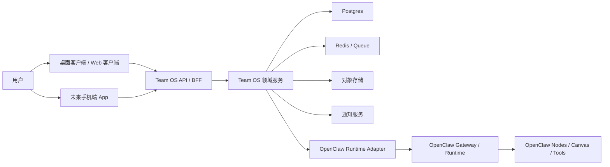

# OpenClaw Team OS 技术架构方案

- 文档版本：v0.1
- 文档状态：Draft
- 更新日期：2026-04-08
- 关联文档：`OpenClaw_Team_OS_PRD.md`
- 目标：明确 OpenClaw Team OS 在技术上如何落地，哪些能力复用 OpenClaw，哪些能力必须自研，以及桌面端与未来手机端如何共享一套后端能力

## 1. 结论先行

### 1.1 能不能复用 OpenClaw

可以。

建议将 OpenClaw 定义为 `执行引擎 / Runtime 层`，而不是直接当成最终产品层。它负责：

- Agent 执行
- Tool 调用
- Gateway 与节点连接
- Canvas / A2UI 承载
- 设备配对与节点能力

而 OpenClaw Team OS 自己负责：

- 组织与团队模型
- 团队模板与一键雇佣
- 任务编排与业务状态机
- 审批、预算、审计
- 团队工作台客户端体验

### 1.2 能不能直接做客户端产品

可以，而且建议直接做。

但“直接做客户端”不等于把 OpenClaw 的现有 UI 改一层皮，而是：

1. 保留 OpenClaw 作为引擎。
2. 另外建立 Team OS 的产品层服务。
3. 构建自己的桌面优先客户端工作台。

### 1.3 能不能再做手机端 App

可以，但建议按阶段推进：

1. 第一阶段：桌面优先客户端
2. 第二阶段：手机端审批与通知 Companion App
3. 第三阶段：手机端轻工作台

不建议一开始就追求桌面端和手机端完整同构，否则产品会过早分散。

## 2. 设计原则

### 2.1 产品层与执行层分离

OpenClaw Team OS 的核心竞争力不在 Runtime，而在“组织化 AI 劳动力管理”。因此必须坚持：

- OpenClaw 负责执行
- Team OS 负责业务模型和治理模型

### 2.2 客户端与引擎解耦

客户端不应直接绑定 OpenClaw 的内部 UI 和内部状态格式，而应通过一层 Team OS API/BFF 访问业务能力。这样做有三个好处：

- 避免 OpenClaw 上游变更直接冲击客户端
- 方便将来加入多种 runtime
- 便于桌面端、Web 端、手机端共享同一业务接口

### 2.3 先单租户稳态，再多租户平台化

首批 Design Partners 阶段建议优先采用 `单组织隔离部署` 或 `逻辑隔离极强的托管部署`，不要过早把多个客户压进同一套共享 runtime 池。

### 2.4 先做业务工作台，再做开放编排

首版技术架构不应以“开放式 Agent Builder”为中心，而应以：

- 团队模板
- 任务状态机
- 审批流
- 预算控制
- 审计追踪

为中心搭建。

## 3. OpenClaw 与 Team OS 的边界

### 3.1 推荐边界划分

| 能力 | 优先复用 OpenClaw | Team OS 自研 | 说明 |
| --- | --- | --- | --- |
| 多 Agent 执行 | 是 | 否 | 作为底层运行时能力使用 |
| Tool 调用 | 是 | 否 | 沿用 OpenClaw tool/plugin 体系 |
| Gateway / Node 连接 | 是 | 否 | 保留设备连接与节点调用能力 |
| Canvas 承载 | 是 | 否 | 可复用 Gateway Canvas Host |
| 自定义 Control UI 挂载 | 可选 | 否 | 适合早期快速原型，不建议长期强耦合 |
| 团队模板系统 | 否 | 是 | 这是产品核心资产 |
| 组织架构与岗位模型 | 否 | 是 | 这是产品核心资产 |
| 一键雇佣团队 | 否 | 是 | 属于产品层 |
| 任务业务状态机 | 否 | 是 | 不能只依赖底层运行状态 |
| 审批流 | 否 | 是 | 属于治理层核心能力 |
| 预算控制 | 否 | 是 | 属于治理层核心能力 |
| 审计日志 | 部分 | 是 | 可消费底层事件，但审计模型必须自建 |
| 团队工作台 UI | 否 | 是 | 必须自建 |
| 商业计费与套餐 | 否 | 是 | 必须自建 |

### 3.2 为什么不能只在 OpenClaw 上“改 UI”

如果只改 UI，不单独建设产品层，后续会遇到几个问题：

- 组织、团队、任务、审批、预算等概念无法稳定建模
- 客户端与 OpenClaw 内部实现强耦合，升级风险大
- 很难支持多终端一致体验
- 很难沉淀 Team OS 自身的业务数据与护城河

## 4. 推荐总体架构



## 5. 核心组件设计

### 5.1 客户端层

客户端层建议包含两个形态：

- 桌面优先客户端
- 浏览器可访问的 Web 版本

首版建议前端代码统一，桌面端采用壳层封装，Web 端复用同一套页面与状态管理。

客户端主要职责：

- 展示团队工作台
- 任务发起与结果查看
- 审批处理
- 预算与日志查看
- 接收实时状态更新与通知

### 5.2 Team OS API / BFF

这是客户端唯一应直接依赖的后端入口，主要职责：

- 聚合多个领域服务
- 做鉴权、会话、权限判断
- 为客户端返回面向产品的 View Model
- 屏蔽 OpenClaw Runtime 的底层差异

建议客户端不要直接调用 OpenClaw Gateway。

### 5.3 Team OS 领域服务

建议最少拆成以下几个逻辑模块，首版可以先作为一个模块化单体实现：

- Organization Service：组织、成员、角色
- Team Template Service：团队模板、岗位模板、版本
- Team Instance Service：已雇佣团队实例
- Task Orchestration Service：任务编排、状态流转、重试
- Approval Service：审批节点、审批记录、回退逻辑
- Budget Service：预算策略、阈值、成本聚合
- Audit Service：关键操作留痕、日志查询
- Deliverable Service：交付物索引、预览、导出

### 5.4 OpenClaw Runtime Adapter

这是一个非常关键的隔离层。

职责：

- 将 Team OS 的业务任务翻译为 OpenClaw 可执行请求
- 消费 OpenClaw 返回的事件、结果与错误
- 做运行时状态到业务状态的映射
- 统一处理上游版本变化

不建议让产品逻辑直接散落在 OpenClaw 调用代码里。

建议第一版就单独抽出这个适配层，即使它初期只是一个服务内部模块。

### 5.5 数据存储

建议采用以下组合：

- `Postgres`：主业务数据库
- `Redis`：任务队列、短期状态缓存、去重、限流
- `Object Storage`：交付物文件、截图、导出包、运行附件

### 5.6 通知服务

通知服务负责：

- 应用内通知
- 邮件提醒
- 后续手机推送
- 审批超时提醒
- 预算超限提醒

首版只需要把通知模型独立出来，不必一开始接太多渠道。

## 6. 推荐技术栈

### 6.1 客户端技术栈

建议：

- `React + TypeScript`
- `Vite` 或 `Next.js` 作为前端构建基础
- `Electron` 作为首版桌面壳

推荐 Electron 作为首版桌面壳的原因：

- 更成熟，适合快速交付客户端产品
- 系统通知、自动更新、托盘、深链支持成熟
- 前端团队上手快
- 便于与 Web 端共享大量代码

如果团队已经有 Rust/Tauri 经验，也可以评估 Tauri，但不建议因为“更轻”而牺牲首版交付速度。

### 6.2 后端技术栈

建议：

- `Node.js + TypeScript`
- `NestJS` 或 `Fastify + 模块化架构`
- `Postgres`
- `Redis + BullMQ` 或等价任务队列

原因：

- 与前端共享 TypeScript 心智成本低
- 更适合快速构建业务 API、BFF、异步任务
- 便于后续招聘与团队协作

### 6.3 移动端技术栈

未来手机端建议：

- `React Native + Expo` 或原生应用

如果首版桌面/Web 采用 React 体系，后续移动端延续 React 技术栈会更利于团队协作，但不应期待直接复用所有 UI 组件。

## 7. 桌面端架构建议

### 7.1 首版桌面端定位

首版桌面端不是“把网页塞进壳里”这么简单，而应承担以下价值：

- 更像工作台，而非一次性访问页面
- 支持系统通知
- 支持任务常驻感知
- 支持快速恢复上次工作上下文
- 后续可接入本地文件、截图、剪贴板等能力

### 7.2 桌面端推荐结构

建议分为三层：

1. UI Layer：React 页面、状态管理、组件系统
2. Desktop Shell Layer：Electron 主进程、通知、托盘、自动更新、深链
3. API Access Layer：统一调用 Team OS API，不直接触碰 OpenClaw Runtime

### 7.3 桌面端首版必做能力

- 登录与组织选择
- 团队工作台
- 任务发起
- 审批中心
- 预算与日志查看
- 系统通知
- 深链跳转到任务或审批项

### 7.4 桌面端首版不建议做

- 自由拖拽编排
- 超重本地缓存编辑器
- 完整离线模式
- 复杂本地插件系统

## 8. 手机端演进建议

### 8.1 手机端的正确定位

首个手机端 App 更适合做 `Companion App`，而不是完整工作台。

更适合的手机场景：

- 收到待审批提醒
- 快速批准 / 驳回
- 查看任务进度
- 预览最近交付物
- 接收预算预警
- 简单评论与补充要求

### 8.2 手机端首版不建议做

- 完整组织图编辑
- 复杂团队模板编辑
- 长篇复杂任务创建
- 大量日志排查与配置管理

### 8.3 手机端技术依赖

手机端依赖与桌面端同一套：

- 用户认证
- 组织与权限
- 审批接口
- 任务状态接口
- 通知服务

手机端不应直接与 OpenClaw Gateway 发生产品级耦合。

### 8.4 手机端与 OpenClaw 的关系

未来可以在两个层面使用 OpenClaw 的移动能力：

1. `产品层`：手机端 App 作为 Team OS 的 Companion App，调用 Team OS API。
2. `运行时层`：OpenClaw 的 iOS / Android Node 能力作为底层设备节点使用。

这两者不是一回事，不应混为一谈。

## 9. OpenClaw 集成方式建议

### 9.1 集成方式 A：挂载自定义 Control UI

OpenClaw 官方支持通过 `gateway.controlUi.root` 挂载自定义 Control UI 构建产物。

适用场景：

- 极早期本地原型
- 内部验证
- 单机实验

优点：

- 搭建快
- 可直接借用 Gateway 承载静态资源

缺点：

- 客户端生命周期与 OpenClaw 强耦合
- 不利于独立产品化
- 不利于独立部署与版本管理

结论：

可用于 POC，但不建议作为正式产品长期架构。

### 9.2 集成方式 B：独立 Team OS 客户端 + Team OS API

这是推荐方案。

适用场景：

- 对外产品化
- 多终端统一
- 后续商业化和多组织支持

优点：

- 架构清晰
- 易于替换或扩展 runtime
- 桌面端、Web、手机端共用同一业务层
- 产品层升级不受 OpenClaw UI 影响

### 9.3 Adapter 调用方式建议

可分两个阶段：

#### 阶段 1

通过 OpenClaw 现有 CLI / Gateway 调用能力做适配封装，快速跑通 MVP。

#### 阶段 2

在 MVP 稳定后，收敛到更直接、可维护的 Gateway 协议或服务级集成方式，减少 CLI 包装层的不稳定性。

## 10. 关键业务流的技术设计

### 10.1 雇佣团队

1. 客户端请求 Team Template 列表。
2. 用户选择模板并填写预算、审批人、组织信息。
3. BFF 调用 Team Instance Service 创建团队实例。
4. 系统生成默认岗位映射、审批规则、预算规则。
5. 客户端进入团队工作台。

### 10.2 发起任务

1. 用户输入业务目标。
2. Task Orchestration Service 创建任务与任务节点。
3. Runtime Adapter 将业务请求翻译为 OpenClaw 执行请求。
4. OpenClaw 开始执行并返回运行事件。
5. Adapter 将底层事件映射为业务状态。
6. 客户端通过轮询、SSE 或 WebSocket 获得更新。

### 10.3 人工审批

1. 当任务进入待审批节点时，Approval Service 创建审批项。
2. 通知服务向桌面端或手机端发送提醒。
3. 用户批准、驳回或要求重做。
4. 审批结果写入 Audit Log。
5. Task Orchestration Service 决定继续执行、回退或结束任务。

### 10.4 预算超限

1. Runtime Adapter 或 Budget Service 汇总当前任务消耗。
2. 当命中阈值时，Budget Service 触发暂停策略。
3. 任务状态切换为 `paused_budget_guard` 或等价业务状态。
4. 客户端展示预算预警。
5. 用户提升预算或终止任务。

## 11. 业务状态机建议

Team OS 必须有自己的业务状态机，不应把 OpenClaw 的底层运行状态直接暴露给用户。

建议首版任务状态：

- `draft`
- `queued`
- `running`
- `waiting_approval`
- `approved`
- `rejected`
- `paused_budget_guard`
- `failed`
- `completed`
- `cancelled`

好处：

- 客户端可稳定渲染
- 审批与预算控制逻辑更清晰
- 未来替换 runtime 时不影响产品层

## 12. 数据模型建议

在 PRD 基础上，技术上建议再补充以下字段思路：

### 12.1 TeamTemplate

- `id`
- `name`
- `version`
- `scenarioType`
- `roleDefinitions`
- `approvalPolicy`
- `budgetDefaults`
- `inputSchema`
- `deliverableSchema`

### 12.2 TeamInstance

- `id`
- `organizationId`
- `templateId`
- `templateVersion`
- `name`
- `runtimeBinding`
- `budgetPolicyId`
- `status`

### 12.3 Task

- `id`
- `teamInstanceId`
- `createdBy`
- `businessGoal`
- `inputPayload`
- `status`
- `runtimeExecutionId`
- `costSnapshot`
- `startedAt`
- `completedAt`

### 12.4 ApprovalItem

- `id`
- `taskId`
- `stepId`
- `approverId`
- `status`
- `decision`
- `comment`
- `createdAt`
- `resolvedAt`

### 12.5 AuditLog

- `id`
- `organizationId`
- `actorType`
- `actorId`
- `entityType`
- `entityId`
- `action`
- `payload`
- `createdAt`

## 13. 部署策略建议

### 13.1 阶段 0：本地验证

适合内部原型或极少量设计伙伴。

形态：

- Team OS 客户端
- Team OS 后端
- 单套 OpenClaw Gateway
- 单个组织或极少量组织

### 13.2 阶段 1：Design Partner 单租户交付

这是最推荐的早期对外交付模式。

建议：

- 每个 Design Partner 拥有独立运行环境
- 独立 OpenClaw Workspace / Gateway / 配置
- 独立数据库或至少独立 schema

优点：

- 隔离性更强
- 风险更低
- 便于调试和建立信任

### 13.3 阶段 2：托管式多租户控制平面

在验证产品价值后再推进。

建议形态：

- 共享控制平面
- 逻辑隔离的业务数据库
- 按组织隔离的 runtime worker 或执行上下文

不建议过早做完全共享执行池。

## 14. 安全与治理架构

### 14.1 组织隔离

首版必须保证：

- 组织级数据隔离
- 组织级预算隔离
- 审计日志按组织隔离
- 交付物按组织隔离

### 14.2 身份与权限

首版建议：

- 应用层独立认证
- Team OS 自己维护 RBAC
- 不把 OpenClaw 的设备配对模型当成产品层权限模型

### 14.3 审计优先

以下行为必须进审计日志：

- 雇佣团队
- 修改预算
- 修改审批规则
- 发起任务
- 批准 / 驳回任务
- 终止任务
- 导出交付物

### 14.4 成本保护

建议首版就做：

- 单任务预算阈值
- 日预算阈值
- 月预算阈值
- 超限自动暂停
- 管理员确认后恢复

## 15. 推荐代码仓结构

建议采用 Monorepo：

```text
openclaw-team-os/
  apps/
    desktop/
    web/
    api/
    mobile/                # 未来阶段
  packages/
    ui/
    domain/
    sdk/
    runtime-adapter/
    config/
  infra/
    docker/
    deploy/
  docs/
    product/
    architecture/
```

### 15.1 结构说明

- `apps/desktop`：Electron 壳与桌面端入口
- `apps/web`：浏览器端入口
- `apps/api`：BFF 与领域服务
- `packages/runtime-adapter`：OpenClaw 适配层
- `packages/domain`：状态机、实体、规则、DTO
- `packages/sdk`：前端统一 API 调用层

## 16. 分阶段落地建议

### 16.1 Phase 0：2-4 周技术验证

目标：

- 跑通一个团队模板
- 跑通任务发起 -> 执行 -> 审批 -> 交付
- 跑通预算阈值拦截

产物：

- 最小后端
- 最小桌面/Web 工作台
- 最小 OpenClaw 适配层

### 16.2 Phase 1：6-10 周 MVP

目标：

- 可对外给 Design Partners 使用
- 支持一个官方团队模板
- 支持组织、任务、审批、预算、日志

### 16.3 Phase 2：桌面端强化

目标：

- 系统通知
- 深链
- 任务上下文恢复
- 更完整的结果看板

### 16.4 Phase 3：手机端 Companion App

目标：

- 推送审批
- 任务状态查看
- 交付物预览
- 轻量反馈

## 17. 最重要的技术决策

以下几个决策建议尽早定下来：

1. 是否接受“OpenClaw 只是执行层，不是产品层”这一原则。
2. 首版是否采用 `独立 Team OS 客户端 + Team OS API` 作为正式方向。
3. 首批客户是否采用单租户交付。
4. 首版桌面端是否使用 Electron。
5. 首版手机端是否只做 Companion App，而非完整工作台。

如果这 5 个问题不先统一，后续架构会反复摇摆。

## 18. 当前推荐方案

如果现在就要开工，我给你的推荐是：

### 18.1 架构选择

- 用 OpenClaw 做 Runtime
- 自建 Team OS 产品层后端
- 做 React + Electron 的桌面优先客户端
- Web 端复用同一套前端逻辑
- 手机端后置，先只预留通知与审批接口

### 18.2 部署选择

- Design Partner 阶段优先单租户
- 每个组织绑定独立 OpenClaw Runtime 环境

### 18.3 产品范围

- 首版只打一个 `AI 增长与内容运营组`
- 不做开放式 Builder
- 不做生态 Marketplace
- 不做完整移动工作台

## 19. 下一步建议

建议从这里继续推进：

1. 把本方案再细化成系统模块清单和接口草图。
2. 画首版桌面端信息架构和关键页面线框。
3. 明确 OpenClaw Adapter 的第一个技术验证路径。
4. 选择 Monorepo 和首版技术栈。
5. 进入 MVP backlog 拆解。

## 20. 一句话总结

最稳的路线不是“把 OpenClaw 改成 Team OS”，而是“以 OpenClaw 为执行引擎，在其上搭建属于你自己的 AI 团队产品层与客户端工作台”。

## 附录 A. 已验证的外部前提

以下前提已基于 OpenClaw 官方仓库与官方文档核验，可作为当前方案的事实基础：

### A.1 开源许可

OpenClaw 官方仓库当前采用 `MIT License`，许可文本允许使用、复制、修改、合并、发布、分发、再许可与销售，但要求保留版权与许可声明。

这意味着：

- 代码复用在许可层面可行
- 正式产品发布时需要做好 License Notice 保留
- 商业化前仍建议补一次商标和第三方依赖合规检查

### A.2 自定义 Control UI

OpenClaw 官方文档明确支持通过 `gateway.controlUi.root` 挂载自定义 Control UI 静态资源。

这意味着：

- 早期可以很快验证 Team OS 原型
- 但正式产品不应长期绑在这一方式上

### A.3 Android / Mobile 能力

OpenClaw 官方文档显示 Android App 当前被定义为 `companion node app`，Android 不承载 Gateway，本身需要连接运行在其他机器上的 Gateway。

这意味着：

- OpenClaw 的移动能力更适合作为底层节点能力
- 你的产品层手机 App 仍应通过 Team OS API 建设
- “OpenClaw 移动节点”与“Team OS 手机产品”应分层设计
